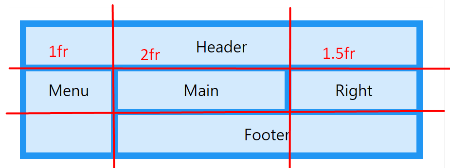
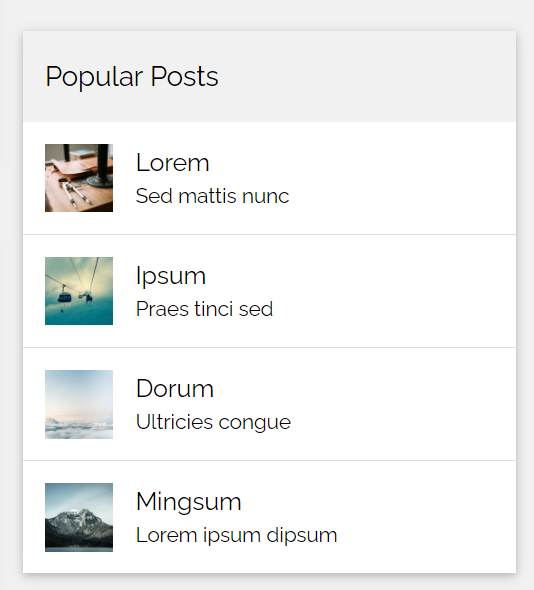

# Grid

1. https://www.w3schools.com/css/css_grid.asp
2. https://css-tricks.com/snippets/css/complete-guide-grid/
3.

## darom

1.  darom visus elementus skirtingom fono spalvom
2. toliau darom  is cia https://www.w3schools.com/w3css/tryw3css_templates_blog.htm
